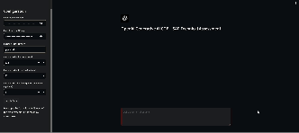

<a name="readme-top"></a>

<div align="center">
<h2>SAP Generative AI COE Technical Assessment</h2>


<a href="#installation">Installation</a> · <a href="#documentation">Documentation</a> · <a href="#contact">Contact</a>
</div>

<!-- ABOUT THE PROJECT -->
## About The Submission


<p style="text-align: justify;">
This submission serves in fulfillment of the requirements for SAP's Generative AI COE technical assessment sent on 2 
January 2024. This application is meant as a prototype Generative AI app utilizing OpenAI API and LangChain framework 
to introduce myself to others. The application responds to queries and receives answers related to my profile, and it
was developed entirely in Python, along with being dockerized in order to provide for an easier installation process.
</p>

<p style="text-align: justify;">
Installation instructions and documentation and slides, detailing my ideas, design choices, and other insights can be 
found below. Should there be any issues, please feel free to contact me!
</p>

<!-- INSTALLATION -->
## Installation
Before getting this submission to run locally within your computer, ensure that the following prerequisites are 
fulfilled:
### Prerequisites
* You must have Docker installed in your computer with an internet connection.
* You must have a file named `api_keys.pdf` locked by a password sent separately. This file contains the API keys.

### Getting Started
1. Download or clone the repository provided above. Store the files locally in a file directory you can access into.
2. Using your Terminal, change your directory to point towards where the Dockerfile is located. Run the following 
command in the Terminal.
    ```shell
    docker build -t tuweile/sap-assignment:1.0.0 .
    ```
3. Once the image has been installed, enter the following command in the Terminal. Ensure that port 8501 is open.
    ```shell
    docker run -p 8501:8501 tuweile/sap-assignment:1.0.0
    ```
4. Once the container has been initialized and is running, go to http://0.0.0.0:8501 to enter into the application.
5. Unlock the file `api_keys.pdf` with the password sent via email in response to the technical assessment. Enter the
API keys (OpenAI and Pinecone) and the environment value (Pinecone) into the configuration sidebar. 
6. If need be, you may customize the chunk size, the chunk overlap, or the k value for response generation for your own
usage. Please give it up to a minute to rebuild the embeddings. Otherwise, you may skip this step.
7. Click on the <b>Apply Data</b> button to apply said settings. You may now use the application and configure 
accordingly.

<p style="text-align: justify;">
You may also find a MP4 video step-by-step guide on the installation steps in the `/public/installation-guide.mp4` 
directory.
</p>

<p style="text-align: justify;">
Should you encounter any issues with the APIs such as insufficient credits or rate limits, please do not hesitate to 
let me know. I will issue a new set of APIs for your reference.
</p>

<!-- DOCUMENTATION -->
## Documentation
Technical documentations detailing the architecture design, ideas, and my evaluations can be found in 
`README-DOCUMENTATION.pdf`.

<!-- CONTACT -->
## Contact
Should you have any inquiries or issues with regards to this submission, please contact me as follows:

Tu Weile - [LinkedIn](https://www.linkedin.com/in/tuweile/) - tuweile@u.nus.edu

Project Link: [https://github.com/TuWeile/SAP-internship](https://github.com/TuWeile/SAP-internship)

[linkedin-url]:https://www.linkedin.com/in/tuweile/
